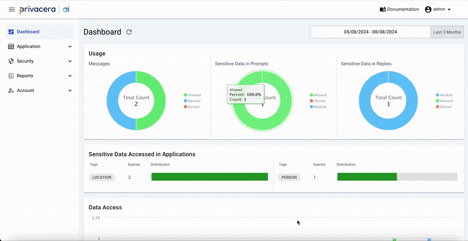

# [PAIG](https://paig.ai)

**PAIG** (Pronounced similar to *paige* or *payj*) is an open-source project designed to protect Generative AI (GenAI)
applications by ensuring security, safety, and observability. As the technologies and approaches for writing GenAI
applications evolve rapidly, PAIG offers a versatile framework that addresses the latest security and safety challenges
and enables the integration of point security and safety solutions without requiring applications to be rewritten.

## Overview

The rapid evolution of technologies and approaches for writing GenAI applications is driving the need for robust
security and safety measures. New use cases are continually emerging, with users experimenting to discover new
possibilities. Despite advancements, there are still many unknowns in the realm of security and safety, necessitating
continuous improvement and adaptation. New tools are launched daily to address various aspects of these challenges,
often resulting in a fragmented landscape of point solutions. There is a need for flexibility to try out new tools
without rewriting applications, customizable solutions to meet specific needs, and future-proofing to ensure long-term
relevance. Comprehensive observability is essential to address security, compliance, and operational reviews.

PAIG is an extensible framework designed to implement security and safety in AI applications. It supports and integrates
seamlessly with a wide range of Large Language Models (LLMs), Vector Databases (VectorDBs), orchestrators, and other AI
tools. As the usage of GenAI evolves, the need for a robust governance framework becomes increasingly important. PAIG
addresses this need by providing a comprehensive solution.

## PAIG's Features

- **Extensibility**: Seamless integration with a wide range of Large Language Models (LLMs), Vector Databases (
  VectorDBs), orchestrators, and other AI tools.
- **Security and Safety**: Implements best practices and recommendations from leading security frameworks such as NIST
  and OWASP.
- **Flexibility**: Allows users to integrate new tools and solutions without the need to rewrite their applications,
  providing a customizable approach to meet specific needs.
- **Observability**: Monitors all invocations to LLMs and Retrieval-Augmented Generation (RAG) systems, providing
  comprehensive observability for security, compliance, and operational reviews.
- **Future-Proofing**: Continuously updated to include the latest security and safety solutions, ensuring long-term
  relevance and protection against emerging threats.
- **User Focus**: Helps users concentrate on their core use cases by providing a robust framework that incorporates the
  best available point solutions.

## Why PAIG

PAIG offers a comprehensive solution for securing and safeguarding GenAI applications in a rapidly evolving
technological landscape. By providing seamless integration with various AI tools and adhering to industry-leading
security practices, PAIG ensures that users can focus on innovation without compromising on safety. Its flexibility and
customizability allow for the easy adoption of new tools, while its future-proofing capabilities ensure continued
relevance and protection. With comprehensive observability features, PAIG addresses the critical need for security,
compliance, and operational transparency, making it an indispensable tool for developers and organizations working with
GenAI applications.

## Getting Started

To get started with PAIG, please refer to the detailed documentation available [here](https://paig.ai/docs/). The
documentation provides comprehensive information on setting up, configuring, and using PAIG to secure your GenAI
applications.

## Contributing

PAIG is an open-source project, and we welcome contributions from the community. Please refer to
our [contributing guidelines](docs/CONTRIBUTING.md) for more information on how to get involved.

## License

PAIG is licensed under the Apache License. For more details, please see the [LICENSE](LICENSE) file.

[TODO: Need to replace the clip with a use case scenario]

