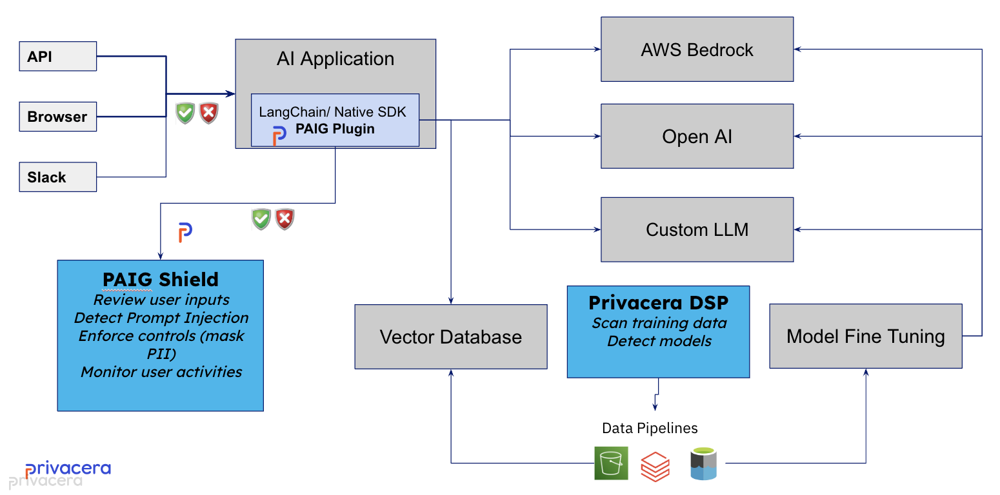

# Integrating PAIG with AI Applications
!!! tip "This section is for the AI Application developers and integrators"

    You need to have some familarity of Large Language Models (LLMs) and  programing languages like Python or REST.

PAIG easily integrates with any AI application (1), offering a variety of flexible options to ensure smooth connectivity and
functionality:
{ .annotate }

1.  :privacera-privacera_p: Read more about AI applications in the [User Guide](../user-guide/applications.md) section.

-   __Transparent Integration with LangChain__

    ---

    Tailored for AI applications developed with LangChain, this method affords
    effortless integration via the Privacera Shield library, ensuring automated policy enforcement. Given the expansive and
    feature-rich library of LangChain, which provides numerous features and components for AI application
    development—including support for Chains and Retrieval Augmented Generation (RAG) that have the potential to modify
    prompts—PAIG ensures that policies are consistently enforced, even on enriched prompts.

    [:octicons-arrow-right-24: LangChain](langchain.md)

-   __Python Library for Native AI Applications__

    ---

    This approach is optimized for AI applications natively developed using
    Python. Integrating the PAIG library directly with the AI application facilitates systematic policy enforcement. It
    also extends considerable flexibility to AI application developers, offering the latitude to invoke PAIG APIs in
    alignment with specific business and technical requirements.

    [:octicons-arrow-right-24: Python AI Application](python-applications.md)

### PAIG Architecture

---
:octicons-tasklist-16: **What Next?**

-   :material-vector-combine: __Integrate With__

    [LangChain](langchain.md)

    [Python Applications](python-applications.md)

<!--    [REST APIs](rest-api.md) -->

-   :material-book-open-page-variant-outline: __Read More__

    [User Guide](../user-guide/)

-   :material-lightning-bolt-outline: __How To__

    [Manage Applications](../how-to/manage-applications/index)

